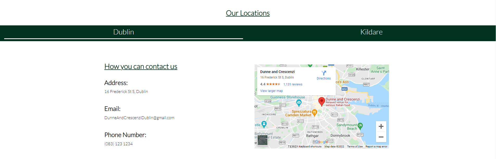

# Dunne and Crescenzi
(Developer: Keith Bautista)

[Live Website](https://keithbautista.github.io/DunneAndCrescenzi/)

## Project Goals

### User Goals

- Ability in finding a restaurant that provides italian food
- Ability to find the menu which provides a clear view of the prices and a sample of the mentioned food.
- Finding information about the restaurant.
- Finding the location of the restaurant and how they can be contacted.

### Site Owner Goals

- Provide a site which displays and replicates the same atmosphere when attending the restaurant.
- Promote the business in a clean and simple manner.
- Promote the the two locations the restaurant has as well as provide the ability to locate each location.
- Provide a way to contact the restaurant through various forms.

## User Experience

### Target Audience

- People looking to dine in the Dublin Kildare region, more specifically Italian Food.
- People who are looking to eat good food in an authentic environment.
- People whom are looking to order in and have their food delivered.
- Groups of people whom are looking for a caterer for an event that they have.

### User Requirements

- A website which is intuitive and is simple to navigate around.
- Easily find information within a couple clicks.
- Good presentation on said information as well as gallery provided.
- Links and Tabs works as expected.
- Ability to easily get in contact with Business through multiple forms of contact.
- Easily access through different forms of interaction (Mobile and Desktop).

## User Stories

#### First Time User

1. As a first time user I would like to see a simple layout that is easily navigatable.
2. As a first time user I would like to know what the restaurant has to offer.
3. As a first time user I would like to see if they cater to any events.
4. As a first time user I would like to know if they cater to children and not only adults.
5. As a first time user I would like to know how to get in contact with the business to conduct a reservation.

#### Returning User

1. As a returning user I would like to see the menu for the different location that they offer.
2. As a returning user I would like to know what the new location offers in terms of food.
3. As a returning user I would like to know what the opening times are for each location that you offer.
4. As a returning user I would like to know the address for each location offered.
5. As a returning user I would like to know how to get in contact with the business through email.
6. As a returning user I would like to know how to get in touch with the business through social media.

#### Site Owner

7. As the site owner I want users to know what what the restaurant offers and the prices.
8. As the site owner I want users to have the ability to get in contact with the business in case further information is needed.
9. As the site owner I want the users to be able to know which location suits them best to dine in.
10. As the site owner I would like the users to see through images on what events can be held.
11. As the site owner I want the users to know our social media handles as word of mouth can increase our site traffic as well as restaurant traffic.

## Design Decisions

### Design Choices

The webpage was designed with the idea of of a warm athmosphere in mind. Images of Pizza create the illusion of warmth as a Pizza dome would provide. The hope is to provide a website which is aesthetically pleasing and provides information in a simple and navigatable manner.

### Color

For color I have kept it simple with the major colors being a dark shade of green (#013220) with aspects of white and black as the majority of the font colors. Hints of grey (#343a40) can also be spotted as the call to action colors so that they differ with the rest of the flow of the page.

More specifically green (#013220) was chosen to mimic the herbs and spices associated within Italian Cuisine.

### Fonts 

Lato with from Google Fonts was used for the majority of this project with a fall back of sans serif. Lato was specifically designed to provide clean information in a concise manner.

### Structure of Pages

The page created is structured in a way which is easy recognizable to other web pages in the way it has a navigation bar on the top of the page and a footer at the bottom of each page. 
The navaigation bar is duplicated in each page so that it is easy to navigate to other pages from the main home page. On this, the website consists of 4 separate pages:

- Home: This is the main page of the website, it consists of a carousel with 3 images that prompts the customer to book a table with the restaurant. The button redirects to the contact us page.

- Menu: This page provides the menu for Dunne and Crescenzi, it provides tabs at the top of the page which allows the user to switch between which location they would prefer to dine in.

- Gallery: This page consists of several images in a grid pattern which showcases the capabilities of Dunne and Crescenzi in terms of event holding/catering.

- Contact Us:
    - The contact us page is divided into 3 sections. "Frequently asked questions", "Book a table" as well as "Our Locations". 

    - Frequently asked questions consists of 3 vertivally aligned cards which once clicked expands to answer the question on the card.

    - Book a table consists of a form again veritically aligned on which the user can fill our to ask a query.

The section "Our Locations" follows the flow of the menu page in which that we provide two different clickable tabs in which the user would like to dine in. Once clicked the location, email address and phone number of each location is provided.

### Wireframes

Home

Menu

Gallery

Contact Us

### Technologies Used During Creation

- HTML
- CSS

### Frameworks & Tools
- Bootstrap v4.6
- Git
- Github
- Balsamiq
- Google Fonts
- Adobe Color
- Font Awesome
- Favicon.io
- Unsplash
- Pexels
- imagecompressor (Compressing Images)
- cloudconvert (Converting Images into WebP Format)

### Features

This website consists of 4 pages.

#### Logo and Navigation Bar

- The navbar is completely responsive and turns into a toggler (hamburger menu) once the screen becomes too small
    - The navbar can be found on all 4 pages of the site.
    - It allows the customer to easily navigate the site.
    - Once the user hovers over a link it an animated underline activates under the link.

#### Carousel

- The carousel consists of 3 images which actively change, they can also be manually changed using the two next and previous controls on either side of the image or by clicking on the horizontal lines on the bottom of the images.
- In the middle of the image is a Call To Action named "Book a Table" which once clicked navigates to the contact us page where the user is able to book a table using the form.

#### Menu and Menu Tabs

- Included in the Menu page is a tab on the top of the page which the user is able to click. It allows the user to be able to click on the menu on which location they would prefer to dine in.
- The menu is in a pattern in which it is easy to read, it provides the starters at the beginning and an image on the right which showcases a sample item on the menu.

#### Gallery 

- There is a separate page in the website named Gallery, this provides users who visit a sample of what Dunne and Crescenzi is able to do in terms of weddings/events/catering.

#### Contact Us
![Contact Us]

- The Contact Us page is separated into 3 separate sections as mentioned earlier
    - Frequently Asked Questions
        - This provides users who visit common questions that have previously been asked. It eliminates the user having to contact and therefore making it a much easier contact.
        
    - Book a Table
        - If the customer prefers to book a table through a form rather than contacting through form, they can (theoretically) do this through the book a table form.
        
    - Our Locations
        - Like the menu, "Our Locations" contains a tab which the user is able to click based on which location we offer is more convenient for them. Once clicked the information provided (Address, Email, Phone Number and Map Details) are updated.
        
        

#### 404 Error Page

- The 404.html page consists of the navigation bar as well as the footer that the other pages include. The addition in this page is an image in the middle of the screen as well as a CTA underneath which links back to the main index.html page. By doing this we are eliminating the task for the user to have to click the back button when they have entered a page in which does not exist.

    
### Validation

#### HTML Validation

The <a href="https://validator.w3.org/">W3C Markup Validation Service</a> was used to validate the HTML of the site. Shown below are screenshots of the validation.

Home

Menu

Gallery

Contact Us

404

#### CSS Validation

The <a href="https://jigsaw.w3.org/css-validator/">W3C CSS Validation Service</a> was used to validate the CSS of the site. Shown below are screenshots of the validation.

Style.CSS External Style Sheet

