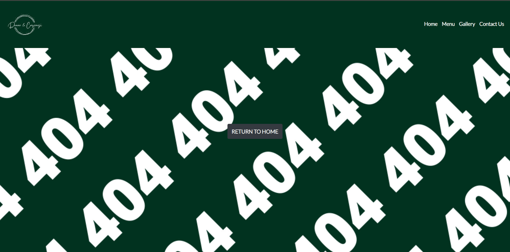

# Dunne and Crescenzi
(Developer: Keith Bautista)

[Live Website](https://keithbautista.github.io/DunneAndCrescenzi/)

## Table of Contents
1. [Project Goals](#project-goals)
    1. [User Goals](#user-goals)
    2. [Site Owner Goals](#site-owner-goals)

2. [User Experience](#user-experience)
    1. [Target Audience](#target-audience)
    2. [User Requirements](#user-requirement)

3. [User Stories](#user-stories)
    1. [First Time User](#first-time-user)
    2. [Returning User](#returning-user)
    3. [Site Owner](#site-owner)

4. [Design Decisions](#design-decisions)
    1. [Design Choices](#design-choices)
    2. [Color](#color)
    3. [Fonts](#fonts)

5. [Structure of Pages](#structure-of-pages)

6. [Wireframes](#wireframes)
    
    

## Project Goals

### User Goals

- Ability in finding a restaurant that provides italian food
- Ability to find the menu which provides a clear view of the prices and a sample of the mentioned food.
- Finding information about the restaurant.
- Finding the location of the restaurant and how they can be contacted.

### Site Owner Goals

- Provide a site which displays and replicates the same atmosphere when attending the restaurant.
- Promote the business in a clean and simple manner.
- Promote the the two locations the restaurant has as well as provide the ability to locate each location.
- Provide a way to contact the restaurant through various forms.

## User Experience

### Target Audience

- People looking to dine in the Dublin Kildare region, more specifically Italian Food.
- People who are looking to eat good food in an authentic environment.
- People whom are looking to order in and have their food delivered.
- Groups of people whom are looking for a caterer for an event that they have.

### User Requirements

- A website which is intuitive and is simple to navigate around.
- Easily find information within a couple clicks.
- Good presentation on said information as well as gallery provided.
- Links and Tabs works as expected.
- Ability to easily get in contact with Business through multiple forms of contact.
- Easily access through different forms of interaction (Mobile and Desktop).

## User Stories

#### First Time User

1. As a first time user I would like to see a simple layout that is easily navigatable.
2. As a first time user I would like to know what the restaurant has to offer.
3. As a first time user I would like to see if they cater to any events.
4. As a first time user I would like to know if they cater to children and not only adults.
5. As a first time user I would like to know how to get in contact with the business to conduct a reservation.

#### Returning User

6. As a returning user I would like to see the menu for the different location that they offer.
7. As a returning user I would like to know what the opening times are for each location that you offer.
8. As a returning user I would like to know the address for each location offered.
9. As a returning user I would like to know how to get in contact with the business through email.
10. As a returning user I would like to know how to get in touch with the business through social media.

#### Site Owner

11. As the site owner I want users to know what what the restaurant offers and the prices.
12. As the site owner I want users to have the ability to get in contact with the business in case further information is needed.
13. As the site owner I want the users to be able to know which location suits them best to dine in.
14. As the site owner I would like the users to see through images on what events can be held.
15. As the site owner I want the users to know our social media handles as word of mouth can increase our site traffic as well as restaurant traffic.

## Design Decisions

### Design Choices

The webpage was designed with the idea of of a warm athmosphere in mind. Images of Pizza create the illusion of warmth as a Pizza dome would provide. The hope is to provide a website which is aesthetically pleasing and provides information in a simple and navigatable manner.

### Color

For color I have kept it simple with the major colors being a dark shade of green (#013220) with aspects of white and black as the majority of the font colors. Hints of grey (#343a40) can also be spotted as the call to action colors so that they differ with the rest of the flow of the page.

More specifically green (#013220) was chosen to mimic the herbs and spices associated within Italian Cuisine.

### Fonts 

Lato with from Google Fonts was used for the majority of this project with a fall back of sans serif. Lato was specifically designed to provide clean information in a concise manner.

## Structure of Pages

The page created is structured in a way which is easy recognizable to other web pages in the way it has a navigation bar on the top of the page and a footer at the bottom of each page. 
The navaigation bar is duplicated in each page so that it is easy to navigate to other pages from the main home page. On this, the website consists of 4 separate pages:

- Home: This is the main page of the website, it consists of a carousel with 3 images that prompts the customer to book a table with the restaurant. The button redirects to the contact us page.

- Menu: This page provides the menu for Dunne and Crescenzi, it provides tabs at the top of the page which allows the user to switch between which location they would prefer to dine in.

- Gallery: This page consists of several images in a grid pattern which showcases the capabilities of Dunne and Crescenzi in terms of event holding/catering.

- Contact Us:
    - The contact us page is divided into 3 sections. "Frequently asked questions", "Book a table" as well as "Our Locations". 

    - Frequently asked questions consists of 3 vertivally aligned cards which once clicked expands to answer the question on the card.

    - Book a table consists of a form again veritically aligned on which the user can fill our to ask a query.

The section "Our Locations" follows the flow of the menu page in which that we provide two different clickable tabs in which the user would like to dine in. Once clicked the location, email address and phone number of each location is provided.

## Wireframes

Home

Menu

Gallery

Contact Us

404

## Technologies Used During Creation

- HTML
- CSS

## Frameworks & Tools
- Bootstrap v4.6
- Git
- Github
- Balsamiq
- Google Fonts
- Adobe Color
- Font Awesome
- Favicon.io
- Unsplash
- Pexels
- imagecompressor (Compressing Images)
- cloudconvert (Converting Images into WebP Format)
- Am I Responsive
- Google Lens

## Features

This website consists of 4 pages.

### Logo and Navigation Bar

- The navbar is completely responsive and turns into a toggler (hamburger menu) once the screen becomes too small
    - The navbar can be found on all 4 pages of the site.
    - It allows the customer to easily navigate the site.
    - Once the user hovers over a link it an animated underline activates under the link.

### Carousel

- The carousel consists of 3 images which actively change, they can also be manually changed using the two next and previous controls on either side of the image or by clicking on the horizontal lines on the bottom of the images.
- In the middle of the image is a Call To Action named "Book a Table" which once clicked navigates to the contact us page where the user is able to book a table using the form.

### Menu and Menu Tabs

- Included in the Menu page is a tab on the top of the page which the user is able to click. It allows the user to be able to click on the menu on which location they would prefer to dine in.
- The menu is in a pattern in which it is easy to read, it provides the starters at the beginning and an image on the right which showcases a sample item on the menu.

### Gallery 

- There is a separate page in the website named Gallery, this provides users who visit a sample of what Dunne and Crescenzi is able to do in terms of weddings/events/catering.

### Contact Us

- The Contact Us page is separated into 3 separate sections as mentioned earlier
    - Frequently Asked Questions
        - This provides users who visit common questions that have previously been asked. It eliminates the user having to contact and therefore making it a much easier contact.
        
    - Book a Table
        - If the customer prefers to book a table through a form rather than contacting through form, they can (theoretically) do this through the book a table form.
        
    - Our Locations
        - Like the menu, "Our Locations" contains a tab which the user is able to click based on which location we offer is more convenient for them. Once clicked the information provided (Address, Email, Phone Number and Map Details) are updated.
        

### Footer

- The footer consists of 3 equally alligned columns which provide 3 separate information. Address which provies the address, Follow Us provides the social media clickable icons and Contact Us which provides the phone number for the restaurant.

### 404 Error Page

- The 404.html page consists of the navigation bar as well as the footer that the other pages include. The addition in this page is an image in the middle of the screen as well as a CTA underneath which links back to the main index.html page. By doing this we are eliminating the task for the user to have to click the back button when they have entered a page in which does not exist.

    
## Validation

### HTML Validation

The <a href="https://validator.w3.org/" target="_blank">W3C Markup Validation Service</a> was used to validate the HTML of the site. Shown below are screenshots of the validation.

Home

Menu

Gallery

Contact Us

404

### CSS Validation

The <a href="https://jigsaw.w3.org/css-validator/" target="_blank">W3C CSS Validation Service</a> was used to validate the CSS of the site. Shown below are screenshots of the validation.

Style.CSS External Style Sheet

## Accessibility

The WAVE WebAIM Accessibility Tool was used to validate and evaluate the accessibility of each page of the site. Please find the screenshots of these below.

Home

Menu

Gallery

Contact Us

404

## Performance

Tool used was Google Lighthouse which is accessible through the inspect tool, and second to last in its navbar. Like Accessibility, screenshots for performance on each page are below.

Home

Menu

Gallery

While Accessibility, Best Practices and SEO are all 100, Performance is 59 which is to be expected due to the amount of images within the gallery. Optimization attempts were to compress each image as well as convert from PNG to WebP which was recommended directly from Google as it was developed by them.

Contact Us

404

## Performing tests on multiple devices

The website was tested on the following devices below:
- Dell Latitude 7820
- OnePlus Nord
- Various Devices were also software tested through Google's Chrome Developer Tool which enables you to toggle the screen size of different devices.

## Browser Compatibility

The website was tested on the following browsers:
- Google Chrome
- Brave
- Microsoft Edge

## Testing User Stories

### First Time User

1. As a first time user I would like to see a simple layout that is easily navigatable.

| **Feature** | **Action** | **Expected Result** | **Actual Result** |
|-------------|------------|---------------------|-------------------|
| Navigation Bar | Ability to Navigate among different pages | Links work as expected and routes to a separate page previous in | Works as expected |

User Story 1 Screenshot

2. As a first time user I would like to know what the restaurant has to offer.

| **Feature** | **Action** | **Expected Result** | **Actual Result** |
|-------------|------------|---------------------|-------------------|
| Menu | Navigate to Menu | Menu page opens and list of foods available is showcased | Works as expected |

User Story 2 Screenshot

3. As a first time user I would like to see if they cater to any events.

| **Feature** | **Action** | **Expected Result** | **Actual Result** |
|-------------|------------|---------------------|-------------------|
| Gallery | Navigate to Gallery | Gallery page opens multiple images are showcased | Works as expected |

User Story 3 Screenshot

4. As a first time user I would like to know if they cater to children and not only adults.

| **Feature** | **Action** | **Expected Result** | **Actual Result** |
|-------------|------------|---------------------|-------------------|
| Menu | Navigate to Menu | Menu page opens and list of foods available is showcased in which 3rd from the bottom the kids menu is evident | Works as expected |

User Story 4 Screenshot

5. As a first time user I would like to know how to get in contact with the business to conduct a reservation.

| **Feature** | **Action** | **Expected Result** | **Actual Result** |
|-------------|------------|---------------------|-------------------|
| Carousel | Navigate to Book a Table | Contact page opens in with an appropriate subheading named "Book A Table" opens | Works as expected |
| Contact Us | Navigate to Contact Us | Contact page opens in with an appropriate subheading named "Book A Table" opens | Works as expected |

User Story 5 Screenshot

### Returning User

6. As a returning user I would like to see the menu for the different location that they offer.

| **Feature** | **Action** | **Expected Result** | **Actual Result** |
|-------------|------------|---------------------|-------------------|
| Menu Tabs | Navigate to Menu on which just underneath the navigation bar are tabs that can be enabled to switch between two locations | Menu opens with tabs, once clicked the menu is updated specifically for the location clicked | Works as expected |

User Story 6 Screenshot

7. As a returning user I would like to know what the opening times are for each location that you offer.

| **Feature** | **Action** | **Expected Result** | **Actual Result** |
|-------------|------------|---------------------|-------------------|
| FAQ | Navigate to Contact Us on which just underneath the navigation bar a subheading "Frequently Asked Question" is evident | Once clicked on an accordion is opened and the answer to the question appears | Works as expected |

User Story 7 Screenshot

8. As a returning user I would like to know the address for each location offered.

| **Feature** | **Action** | **Expected Result** | **Actual Result** |
|-------------|------------|---------------------|-------------------|
| Our Locations | Navigate to Contact Us on which just underneath the navigation bar a subheading "Our Locations" is evident | Similar to Menu, click on tab for location you prefer to dine in and address is provided | Works as expected |

User Story 8 Screenshot

9. As a returning user I would like to know how to get in contact with the business through email.

| **Feature** | **Action** | **Expected Result** | **Actual Result** |
|-------------|------------|---------------------|-------------------|
| Our Locations | Navigate to Contact Us on which just underneath the navigation bar a subheading "Our Locations" is evident | Similar to Menu, click on tab for location you prefer to dine in and email address is provided | Works as expected |
| FAQ | Navigate to Contact Us on which just underneath the navigation bar a subheading "Frequently Asked Question" is evident | Once clicked on an accordion is opened and the answer to the question appears | Works as expected |

User Story 9 Screenshot

10. As a returning user I would like to know how to get in touch with the business through social media.

| **Feature** | **Action** | **Expected Result** | **Actual Result** |
|-------------|------------|---------------------|-------------------|
| Our Locations | Navigate to Contact Us on which just underneath the navigation bar a subheading "Our Locations" is evident | Similar to Menu, click on tab for location you prefer to dine in and email address is provided | Works as expected |

User Story 10 Screenshot

### Site Owner

11. As the site owner I want users to know what what the restaurant offers and the prices.

| **Feature** | **Action** | **Expected Result** | **Actual Result** |
|-------------|------------|---------------------|-------------------|
| Menu | Navigate to Menu | Provides Menu items as well as prices | Works as expected |

User Story 11 Screenshot

12. As the site owner I want users to have the ability to get in contact with the business in case further information is needed.

| **Feature** | **Action** | **Expected Result** | **Actual Result** |
|-------------|------------|---------------------|-------------------|
| Our Locations | Navigate to Contact Us on which just underneath the navigation bar a subheading "Our Locations" is evident | Similar to Menu, click on tab for location you prefer to dine in and email address is provided | Works as expected |
| FAQ | Navigate to Contact Us on which just underneath the navigation bar a subheading "Frequently Asked Question" is evident | Once clicked on an accordion is opened and the answer to the question appears | Works as expected |

User Story 12 Screenshot

13. As the site owner I want the users to be able to know which location suits them best to dine in.

| **Feature** | **Action** | **Expected Result** | **Actual Result** |
|-------------|------------|---------------------|-------------------|
| Our Locations | Navigate to Contact Us on which just underneath the navigation bar a subheading "Our Locations" is evident | Similar to Menu, click on tab for location you prefer to dine in and address is provided | Works as expected |

User Story 13 Screenshot

14. As the site owner I would like the users to see through images on what events can be held.

| **Feature** | **Action** | **Expected Result** | **Actual Result** |
|-------------|------------|---------------------|-------------------|
| Gallery | Navigate to Gallery | Gallery page opens multiple images are showcased | Works as expected |

User Story 14 Screenshot

15. As the site owner I want the users to know our social media handles as word of mouth can increase our site traffic as well as restaurant traffic.

| **Feature** | **Action** | **Expected Result** | **Actual Result** |
|-------------|------------|---------------------|-------------------|
| Our Locations | Navigate to Contact Us on which just underneath the navigation bar a subheading "Our Locations" is evident | Similar to Menu, click on tab for location you prefer to dine in and email address is provided | Works as expected |

User Story 15 Screenshot

## Bugs and their Fixes

| **Bug** | **Fix** |
|-------------|------------|
|Div Alt Content for Carousel as this will appear as an error during validation| Reformat Carousel so that it uses img rather than style: background|
|Responsiveness of Carousel Images| Implement multiple media queries which change the image height based on screen size|
|Rather lacking contrast between the carousel text and the image itself| Implemented a background on the carousel text and set its background to rgb with a 4th input which is the alpha, this mimics opacity without touching the text |
|Tab once toggled matches white background| Change background to dark shade mentioned in Color Descisions above|

## Deployment
The website was deployed using GitHub Pages by following these steps:
1. In the GitHub repository navigate to the Settings tab
2. On the left hand menu select Pages
3. For the source select Branch: master
4. After the webpage refreshes automaticaly you will se a ribbon on the top saying: "Your site is published at https://keithbautista.github.io/DunneAndCrescenzi/"
- Prior to this, I used the GitPod Interface to create the website, please note that GitPod is linked with GitHub which made it easy to make any changes, see changes in real time and also commit and push changes to GitHub.

To fork the following repository
1. Go to the GitHub repository.
2. Click on Fork icon in top right hand corner of the page.

You can clone the repository by following these steps:
1. Go to the GitHub repository 
2. Locate the Code Tab above the list of files and click it 
3. Select if you prefer to clone using HTTPS, SSH, or Github CLI and click the copy button to copy the URL to your clipboard
4. Open Git Bash
5. Change the current working directory to the one where you want the cloned directory
6. Type git clone and paste the URL from the clipboard ($ git clone https://github.com/YOUR-USERNAME/YOUR-REPOSITORY)
7. Press Enter to create your local clone.

## Credits 

Images not referenced below are owned by the developer.

### Media
In order of apearance:
- [carousel-1](assets/images/carousel-image1.webp): Photo by <a href="https://unsplash.com/@lum3n">LUM3N</a
- [carousel-2](assets/images/carousel-image2.webp): Photo by <a href="https://unsplash.com/@nik_owens">Nik Owens</a
- [carousel-3](assets/images/carousel-image3.webp): Photo by <a href="https://unsplash.com/@anniespratt">Anne Spratt</a
- [menu-item-1](assets/images/menu-item-garlic-bread2.webp): Photo by <a href="https://unsplash.com/@sandevil">Sandevil Sandh</a
- [menu-item-2](assets/images/menu-item-pasta-pomodoro.webp): Photo by <a href="https://unsplash.com/@mggbox">Mgg Vitchakorn</a
- [menu-item-3](assets/images/menu-item-chocolate-tart.webp): Photo by <a href="https://unsplash.com/photos/9gnGwsRS6XY">Rens D</a
- [menu-item-4](assets/images/menu-item-bruschetta.webp): Photo by <a href="https://unsplash.com/@margzu">Margarita Zueva</a
- [menu-item-5](assets/images/menu-item-pasta-bolognese.webp): Photo by <a href="https://unsplash.com/@nerfee">Nerfee Mirandilla</a
- [menu-item-6](assets/images/menu-item-kids-pasta.webp): Photo by <a href="https://www.pexels.com/@enginakyurt">Engin Akyurt</a
- [menu-item-7](assets/images/menu-item-apple-crumble.webp): Photo by <a href="https://unsplash.com/@massimorinaldi27">Massimo Rinaldi</a
- [gallery-catering-image-1](assets/images/gallery-catering-image1.webp): Photo by <a href="https://www.pexels.com/@expect-best-79873">Expect Best</a
- [gallery-catering-image-2](assets/images/gallery-catering-image2.webp): Photo by <a href="https://www.pexels.com/@mat-brown-150387">Mat Brown</a
- [gallery-catering-image-3](assets/images/gallery-catering-image3.webp): Photo by <a href="https://www.pexels.com/@pixabay">Pixabay</a
- [gallery-catering-image-4](assets/images/gallery-catering-image2.webp): Photo by <a href="https://www.pexels.com/@mat-brown-150387">Mat Brown</a
- [gallery-catering-image-5](assets/images/gallery-catering-image5.webp): Photo by <a href="https://unsplash.com/photos/fn0xXL9szcU">https://unsplash.com/@katriensterckx</a
- [gallery-catering-image-6](assets/images/gallery-catering-image6.webp): Photo by <a href="https://unsplash.com/@medinacatering">Medina Catering</a

## Code and Acknowledgements
Thank you to Mo Shami on his feedback and guidance in getting this project over the line.
Creating this website meant that I relied on Stack Overflow, W3Schools, Youtube, Bootstrap Documentation and of course the course content for Full Stack Development provided by Code Institute.
<a href="https://getbootstrap.com/docs/4.1/components/navbar/">Bootstrap</a> used for Navbar, Carousel, Button Format.
<a href="https://www.w3schools.com/html/default.asp">W3Schools</a> used for Text Formatting, Text-Decoration, Media Queries 

Please be advised that this project is for educational use only and was created for the Code Institute Full Stack Module.